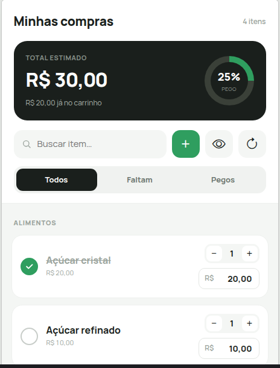

<h1 align="center">🛒 Lista de Compras</h1>

<p align="center">
  Um app de lista de compras feito em React — adicione produtos, controle quantidades e preços,
  acompanhe o total estimado e o quanto você já colocou no carrinho.
</p>

<p align="center">
  
  
  
  
</p>

<p align="center">
  <a href="https://lista-compras-psi.vercel.app/"><b>🔗 Acessar</b></a>
</p>

---

## 📸 Preview

<p align="center">
  
</p>

---

## ✨ Funcionalidades

- 🗂️ **Categorias** — produtos separados em **Alimentos** e **Limpeza**, ordenados alfabeticamente.
- ➕➖ **Quantidade por item** — cada produto tem seu próprio contador (para em 0).
- 💰 **Preço por item** — digitação no formato de centavos (`0,01` → `0,13` → `1,35`) com total por linha.
- 📊 **Total estimado + anel de progresso** — soma de tudo, quanto já está no carrinho e o % de itens pegos.
- ✅ **Marcar como "pego"** — check redondo que risca o item e alimenta o progresso.
- 🔎 **Busca** — filtra os produtos pelo nome em tempo real (ignorando acentos).
- 🎚️ **Filtro Todos / Faltam / Pegos** — mostra os itens conforme o status.
- 👁️ **Ocultar zerados** — esconde produtos sem quantidade com um clique.
- 🔄 **Resetar lista** — volta ao estado inicial (com opção de resetar para a lista original).
- 📝 **Adicionar, editar e excluir** produtos personalizados.
- ⬆️ **Voltar ao topo** — botão flutuante que surge ao rolar a lista.
- 💾 **Persistência** — tudo salvo no `localStorage` (não perde ao recarregar).
- 📱 **Responsivo** — layout mobile-first que se adapta a telas estreitas.

---

## 🛠️ Tecnologias

- [React 18](https://react.dev/) (Create React App)
- CSS puro com variáveis de tema (design tokens)
- [Bootstrap Icons](https://icons.getbootstrap.com/)
- [React Toastify](https://fkhadra.github.io/react-toastify/) — notificações
- `localStorage` para persistência
- ESLint + Prettier

---

## 🚀 Como rodar localmente

Pré-requisitos: **Node.js** e **Yarn** (ou npm) instalados.

```bash
# clone o repositório
git clone https://github.com/VictorLoures/listaCompras.git
cd listaCompras

# instale as dependências
yarn install

# rode em modo desenvolvimento
yarn start
```

O app abre em [http://localhost:3000](http://localhost:3000).

---

## 📜 Scripts disponíveis

| Comando         | Descrição                                 |
| --------------- | ----------------------------------------- |
| `yarn start`    | Roda o app em modo desenvolvimento        |
| `yarn build`    | Gera a build de produção em `build/`      |
| `yarn test`     | Executa os testes                         |
| `yarn lint`     | Verifica o código com ESLint              |
| `yarn lint:fix` | Corrige problemas de lint automaticamente |
| `yarn format`   | Formata o código com Prettier             |
| `yarn deploy`   | Publica no GitHub Pages                   |

---

## 📁 Estrutura do projeto

```
listaCompras/
├── public/
│   └── index.html            # HTML base (fontes e ícones)
├── src/
│   ├── components/
│   │   ├── ComponenteTabela.js  # Lista de itens (cards) de uma categoria
│   │   └── Modal.js             # Modal reutilizável (incluir/editar/excluir/resetar)
│   ├── utils/
│   │   └── ProdutosIniciais.js  # Produtos pré-cadastrados + ordenação
│   ├── App.js                # Estado, regras de negócio e layout
│   └── App.css               # Estilos e design tokens
└── package.json
```

---

## 🧠 Como funciona

- Os produtos **pré-cadastrados** ficam em `src/utils/ProdutosIniciais.js`, divididos entre
  `produtosIniciaisAlimentos` e `produtosIniciaisLimpeza`.
- Cada alteração (quantidade, preço, "pego", inclusão/exclusão) atualiza o estado e é gravada no
  `localStorage`, então a lista é restaurada ao reabrir a página.
- O **Total estimado** soma `quantidade × preço` de todos os itens com quantidade; o **anel** mostra
  a proporção de itens já marcados como pegos.

---

## 👤 Autor

Feito por **Victor Loures**.
